| page_type | languages | products | description
| ---- | ---- | ---- | ---- |
| sample | HTML, CSS, JavaScript/ReactJS | office-teams | The Flight Turnaround application enables airline companies manage their flights, airport teams, and flight tasks.
Staff can with different roles can interact with the application to complete flight tasks and operations.

# Flight Turnaround
| [Deployment guide](#deployment-guide) | [Architecture](#architecture) |
| ---- | ---- |

The Flight Turnaround application enables airline companies manage their flights, airport teams, and flight tasks.
Staff can with different roles can interact with the application to complete flight tasks and operations.

## Key Features

The app can be used in the following ways:-
- Turnaround Admin can view all created airport teams. 

- Admin can create, edit airport teams and add users to the team, this will create/edit teams on Microsoft Teams.
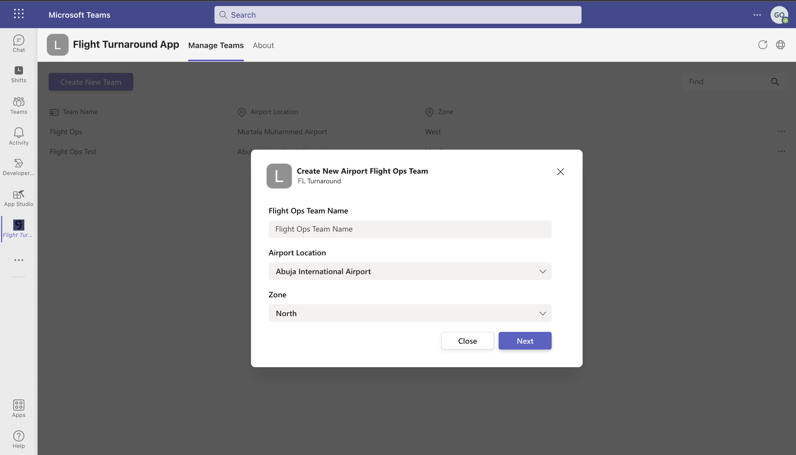
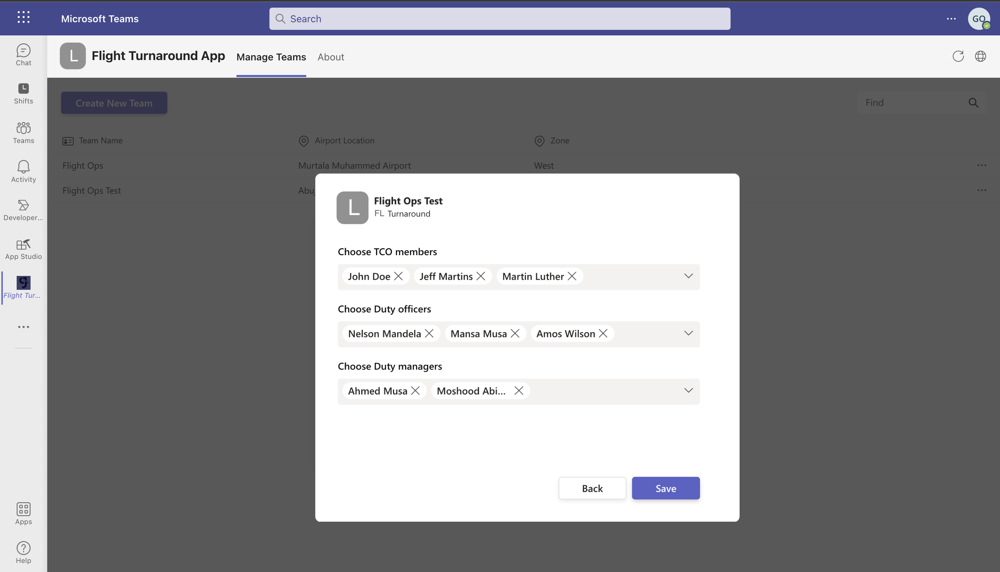

- Admin can delete airport teams.

- The HQ Leadership user can view and filter flights by origin, destination and day.

- The HQ Leadership user can view the activity of a single flight.
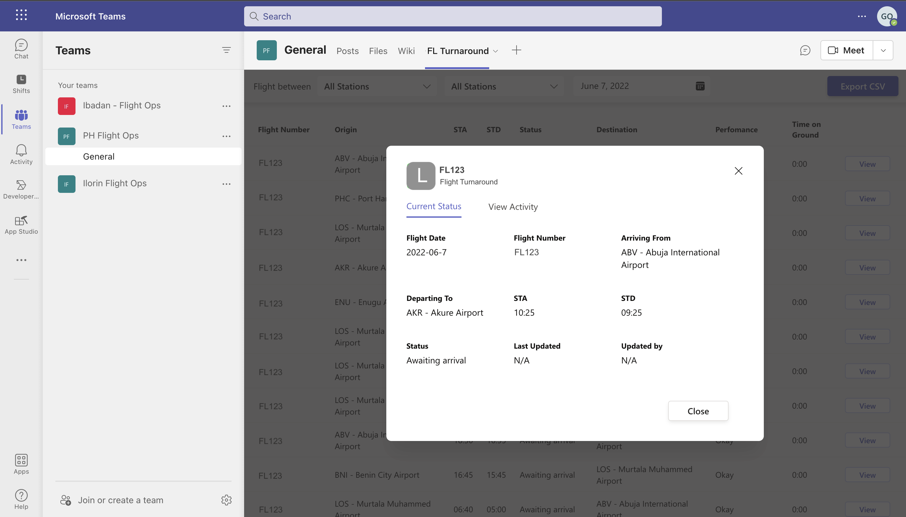

- The HQ Leadership user export lists of flights in CSV format.

- The Bot sends notifications for daily scheduled flights to appropriate airport teams/channels
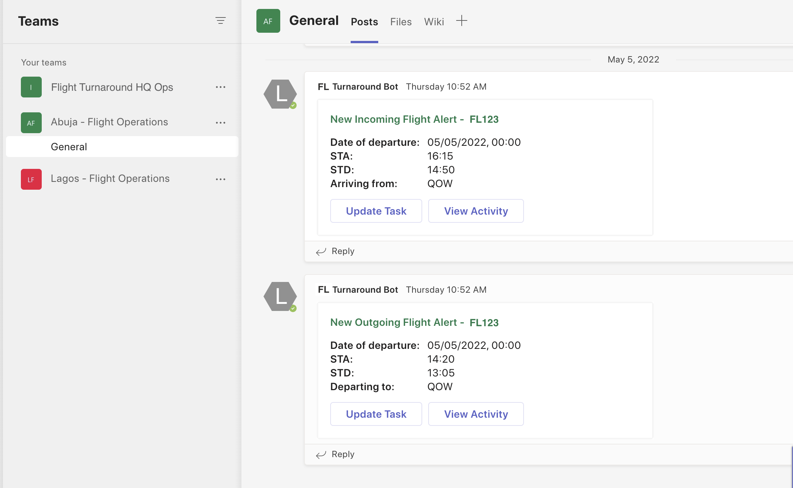

- The Bot also sends notifications for due tasks (Pre Flight, Post Departure, etc) to appropriate airport teams/channels
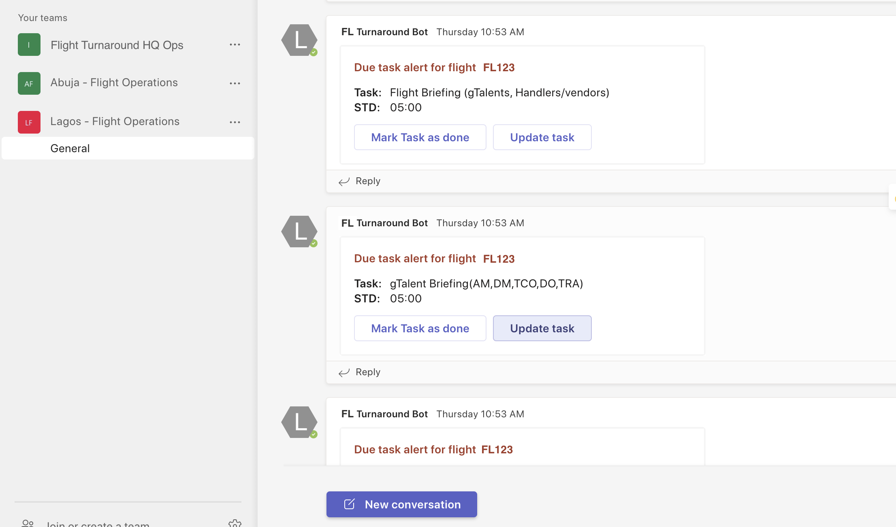

- Authorized team members can make a task as done, using the CTA button on the post adaptive card.
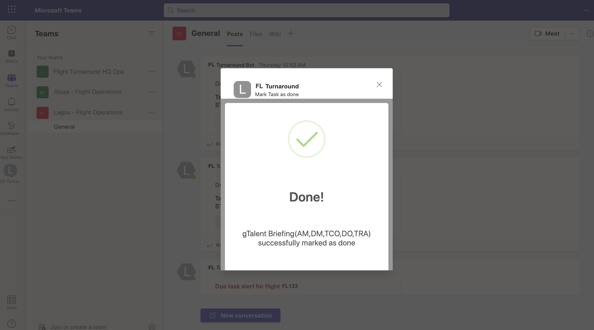

- All done tasks are marked with the user and timestamp to avoid redundant action.
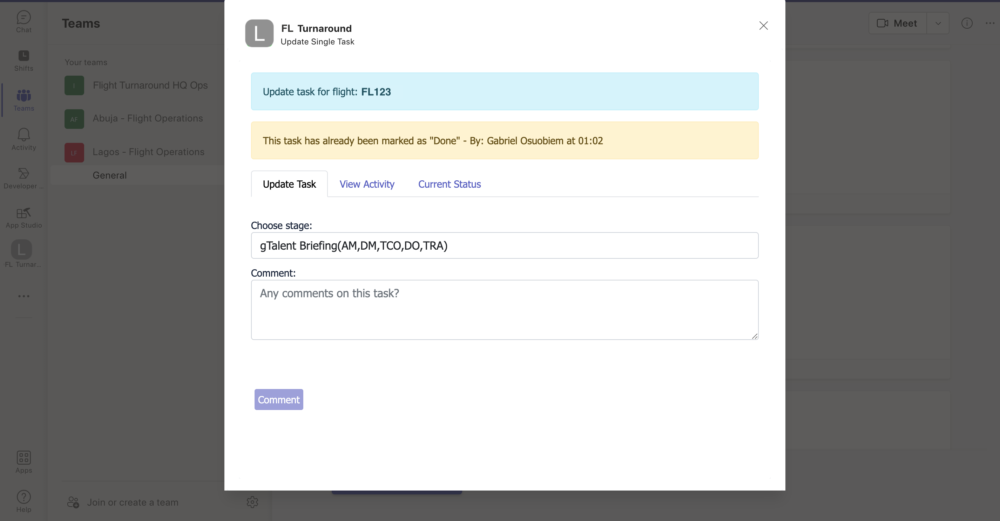

- Users can view all task done for a flight, with timestamp and user that marked the task as done.
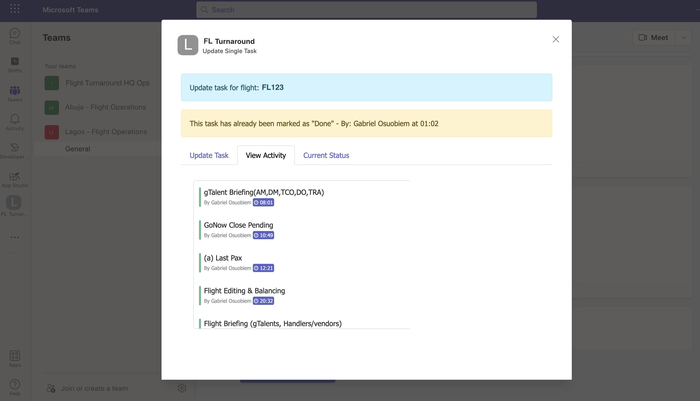

- Users can view the current status/summary of a flight on any of the task adaptive cards.
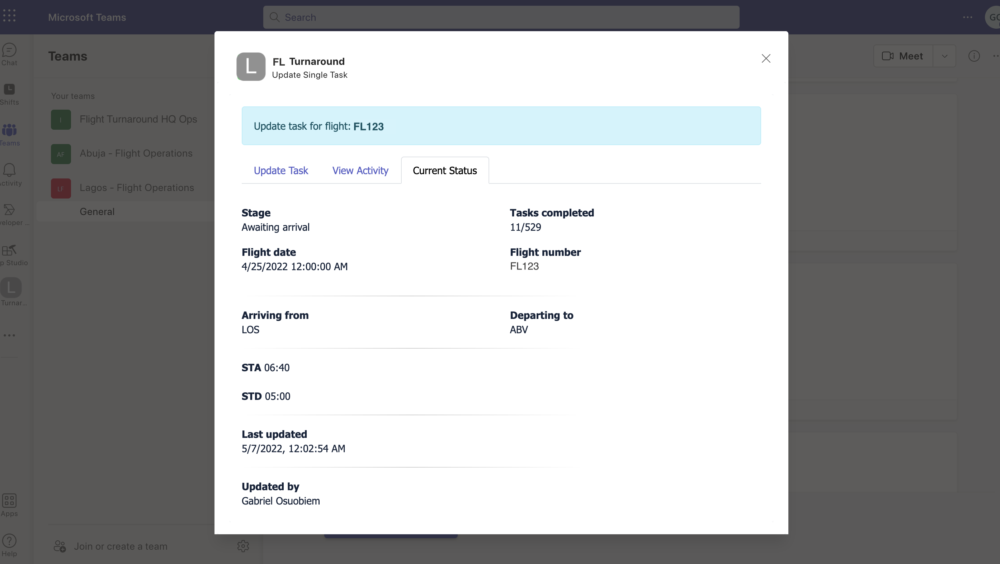

---
# Deployment guide
## Prerequisites

To begin, you will need:  

 - An Azure subscription where you can create the following kind of resources:
 	- App Service 
 	- App Service plan
  	- Bot service

 - A copy of the Turnaround app GitHub [repo](https://github.com/osuobiem/flight-turnaround)
 
## Step 1: Register Azure AD application

Register one Azure AD application in your tenant's directory: for the bot and tab app authentication.

1. Log in to the Azure portal from your subscription, and go to the "App registrations" blade [here](https://portal.azure.com/#blade/Microsoft_AAD_IAM/ActiveDirectoryMenuBlade/RegisteredApps). Ensure that you use a tenant where admin consent for API permissions can be provided at the end of Step 3.

2. Click on "New registration", and create an Azure AD application.

3. **Name:** The name of your Teams app - if you are following the template for a default deployment, we recommend "Flight Turnaround".

4. **Supported account types:** Select "Accounts in any organizational directory"

5. **Redirect URL:** Select *Single-page application (SPA)*, the URL of the hosted application, say https://theapp.azure.com/admin. Make sure your append `/admin` to the URL.
	

6. Click on the "Register" button.

7. When the app is registered, you'll be taken to the app's "Overview" page. Copy the **Application (client) ID** and **Directory (tenant) ID**; we will need it later.

	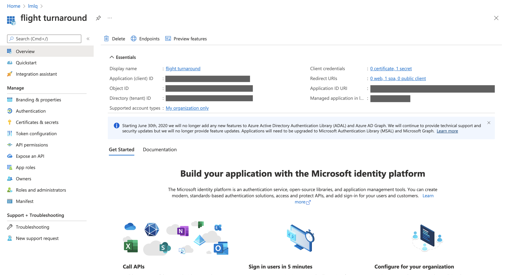

8. On the side rail in the Manage section, navigate to the "Certificates & secrets" section. In the Client secrets section, click on "+ New client secret". Add a description for the secret and select Expires as "24 Months". Click "Add".

	
	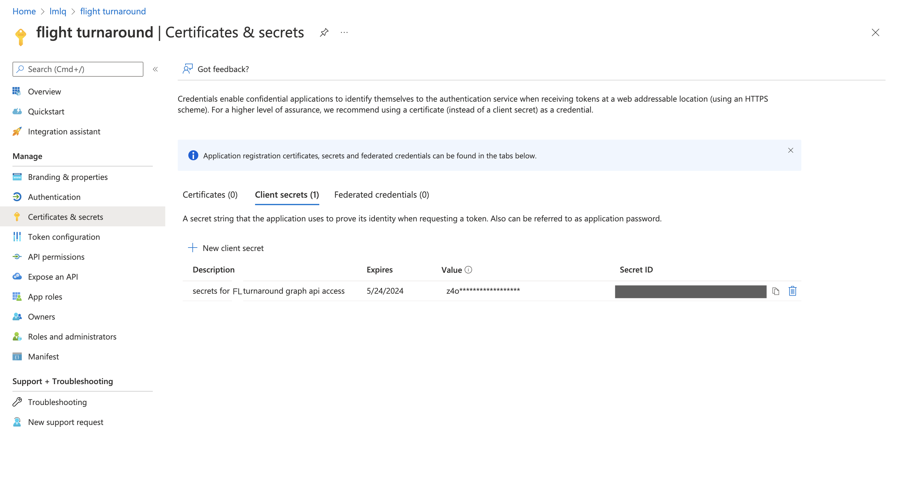
 
9. Once the client secret is created, copy its **Value**, please take a note of the secret as it will be required later.

We recommend that you copy these values into a text file, using an application like Notepad. We will need these values later.

## Step 2: Deploy to your Azure subscription

 10. Now create an **App Service** for the Bot code. On the seach bar, search for **App Service** and click on it.

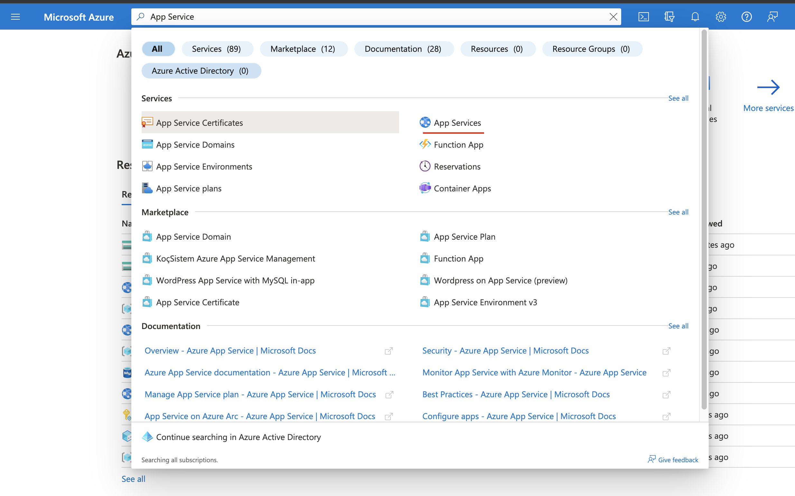

11. From the page displayed, click on Create.

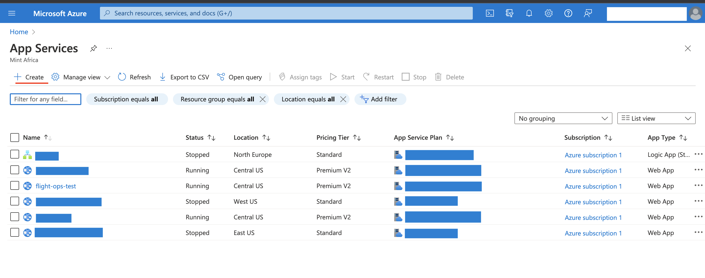

12. Enter the required (Select **Node 14 LTS** for Runtime stack) info on the create form and click on **Review + create**

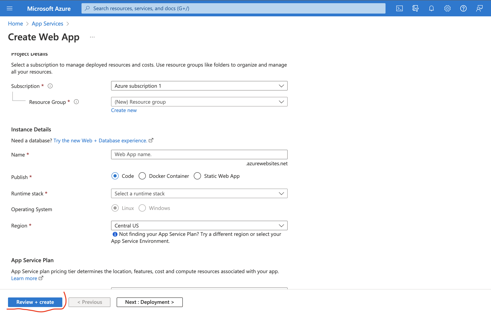

13. Click on **Create** on the next screen

14. Wait for validation and the deployment to reach completion.

15. When complete, with no issues, click on **Go to resource** button

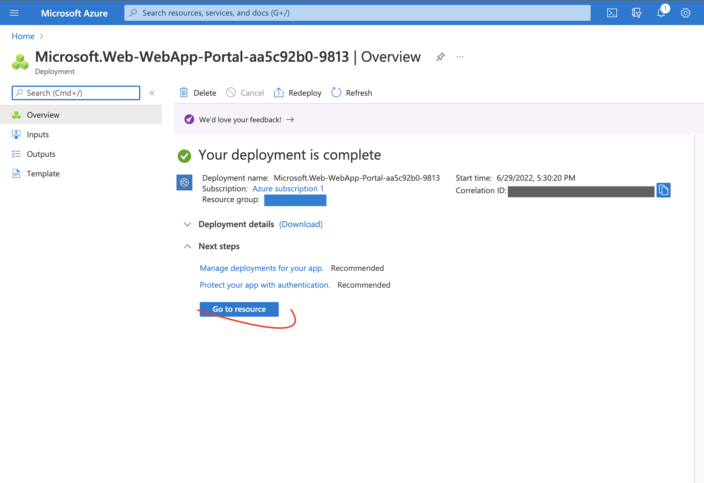.

You can see details of the App service we just created.

16. Next we create a Azure Storage Account (DB) to hold information our app needs.
Search ***Storage Accounts*** on the azure search bar, and click on it.

17. Click on create and enter the required details on the creation form.

18. After entering all the required details, click on **Review + create**.

19. On the next page, click on **Create** and wait for Azure to validate and deploy the storage account.

20. Click on **Go to resource**

21. On the displayed page, on the left pane, click on **Access keys**, click on **Show keys** on the top bar. Then copy out the : **Storage account name** and **key1**.
Keep them save for later use.

.

## Step 3: Set up authentication for the app

1. Go back to the "App Registrations" page [here](https://portal.azure.com/#blade/Microsoft_AAD_IAM/ActiveDirectoryMenuBlade/RegisteredApps)

2. Click on the application (this should be the same application registered in step 1)

3. Under left menu, select **Expose an API** under **Manage**.

	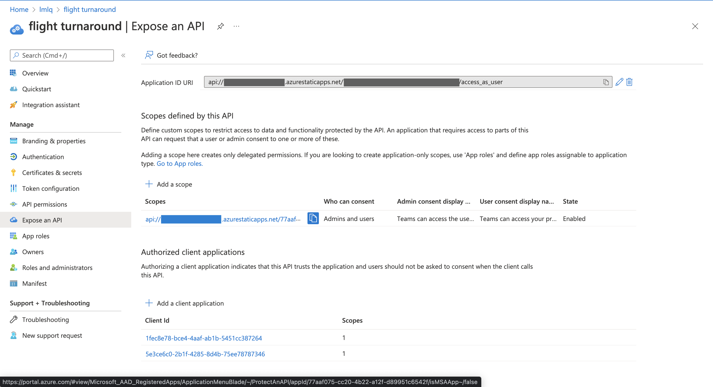

10. Select the **Set** link to generate the Application ID URI in the form of `api://{clientId}`. Insert your fully qualified domain name (with a forward slash "/" appended to the end) between the double forward slashes and the GUID. The entire ID should have the form of: `api://[baseresourcename].azurefd.net/{clientId}`

	- for e.g.: `api://flight-turnaround.azurefd.net/6b5bcd9e-a88d-4daa-a651-1908bb5e7cf7`.

11. Select the **Add a scope** button. In the panel that opens, enter `access_as_user` as the **Scope name**.

12. Set Who can consent? to "Admins and users"

13. Fill in the fields for configuring the admin and user consent prompts with values that are appropriate for the `access_as_user` scope. Suggestions:

	- **Admin consent display name:** Flight Turnaround  Admin
	- **Admin consent description:** Allows Teams to call the app’s web APIs as the current user.
	- **User consent display name:** Flight Turnaround  User
	- **User consent description:** Enable Teams to call this app’s APIs with the same rights that you have.

14. Ensure that **State** is set to **Enabled**

15. Select **Add scope**

	- Note: The domain part of the **Scope name** displayed just below the text field should automatically match the **Application ID** URI set in the previous step, with `/access_as_user` appended to the end; for example:
		- `api://flight-turnaround.azurefd.net/6b5bcd9e-a88d-4daa-a651-1908bb5e7cf7/access_as_user`

16. In the same page in below section **Authorized client applications**, you identify the applications that you want to authorize to your app’s web application. Each of the following IDs needs to be entered. Click "+Add a client application" and copy-paste the below id and select checkbox "Authorized scopes". Repeat the step for second GUID.

- `1fec8e78-bce4-4aaf-ab1b-5451cc387264` (Teams mobile/desktop application)
- `5e3ce6c0-2b1f-4285-8d4b-75ee78787346` (Teams web application)

17. Under left menu, navigate to **API Permissions**, and make sure to add the following permissions of Microsoft Graph API > Delegated permissions:

	- User.Read.All
	- Calendars.ReadWrite
	- Channel.Create
	- Channel.Delete.All
	- Channel.ReadBasic.All
	- ChannelMember.Read.All
	- ChannelMember.ReadWrite.All
	- ChannelMessage.Send
	- email
	- Group.Read.All
	- Group.ReadWrite.All
	- GroupMember.Read.All
	- GroupMember.ReadWrite.All
	- MailboxSettings.Read
	- offline_access
	- openid
	- People.Read
	- People.Read.All
	- profile
	- Team.Create
	- Team.ReadBasic.All
	- TeamMember.Read.All
	- TeamMember.ReadWrite.All
	- TeamSettings.Read.All
	- TeamSettings.ReadWrite.All
	- TeamsTab.ReadWriteForUser
	- User.Read
	- User.Read.All
	- User.ReadBasic.All

	Click on “Add Permissions” to commit your changes.

18. If you are logged in as the Global Administrator, click on the “Grant admin consent for %tenant-name%” button to grant admin consent else, inform your admin to do the same through the portal or follow the steps provided here to create a link and send it to your admin for consent.

19. Global Administrator can grant consent using following link: https://login.microsoftonline.com/common/adminconsent?client_id=<%appId%>

**Note:** The detailed guidelines for registering an application for SSO Microsoft Teams tab can be found [here](https://docs.microsoft.com/en-us/microsoftteams/platform/tabs/how-to/authentication/auth-aad-sso)

## Step 4: Create the Teams app packages

This step covers the Teams application package creation for personal and teams scope and make it ready to install in Teams.
Create a Teams app package for end-users to install the app in personal.

1. Open the `Developer Portal > App Studio` app on Microsoft Teams.

2. Click on **Create a new app** on the left pane.

3. In the App details section, fill in the
	- `App names` (Short and Full)
	
	- `Click on Generate` to generate a new UUID for the application

	- `Packange Name` (e.g `com.microsoft.teams.flightturnaround`)

	- `Version` (e.g `1.0.0`)

	- `Descriptions` (Short and Full)

    - `developer.name` ([What's this?](https://docs.microsoft.com/en-us/microsoftteams/platform/resources/schema/manifest-schema#developer))

    - `developer.websiteUrl`

    - `developer.privacyUrl`

    - `developer.termsOfUseUrl`

	- `Branding` (Logos)

4. Under Capabilities in the Tabs section
	- Click the **Add** button under **Teams tab**, the configuration URl should look like this `https://application-hostname.com/configure`. Make sure you add `/configure` at the end.
		Under **Scopes**, check **Team** and click **Save**

	- Click the **Add** button under **Add a personal tab**, the Tab Title can be anything but we recommend `Manage Teams`, and `manageTeams` for the Entity ID. The content and website URls should look like this `https://application-hostname.com/admin`, Make sure you add `/configure` at the end.

5. [ ] Add docs for Turnaround Bot

6. Under Finish in the Domains and permisions section
	- Paste the `Azure Application (client) ID` you copied earlier in the `AAD App ID` field

	- Paste the `Application ID URI` you copied from Azure earlier (that looks like this `api://flight-turnaround.azurefd.net/6b5bcd9e-a88d-4daa-a651-1908bb5e7cf7/access_as_user`) in the `Single-Sign-On` field.

7. Go to **Test and Distribute** and click **Download** to download the application in zip format.

## Step 5: Run the apps in Microsoft Teams

1. If your tenant has side loading apps enabled, you can install your app by following the instructions [here](https://docs.microsoft.com/en-us/microsoftteams/platform/concepts/apps/apps-upload#load-your-package-into-teams)

2. You can also upload it to your tenant's app catalog, so that it can be available for everyone in your tenant to install. See [here](https://docs.microsoft.com/en-us/microsoftteams/tenant-apps-catalog-teams)
	
	- We recommend using [app permission policies](https://docs.microsoft.com/en-us/microsoftteams/teams-app-permission-policies) to restrict access to this app to the members of the experts team.

3. Install the app (the flight-turnaround.zip package).

# Architecture
